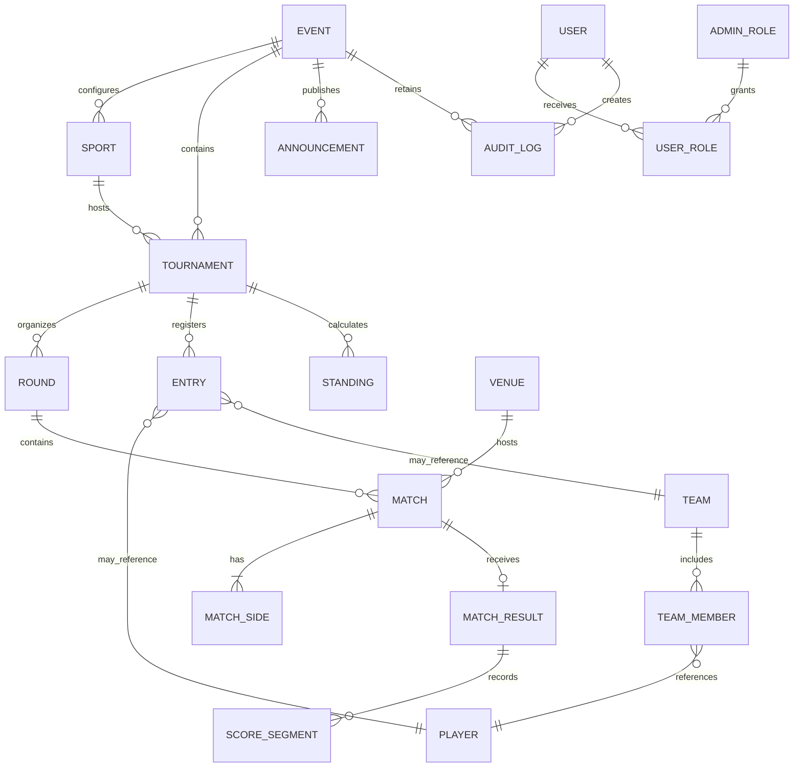

# Architecture Plan

## Product boundaries

The application is split into five explicit areas:

1. Public event website for schedules, live matches, brackets, results, search, champions, and archives.
2. Admin application for event setup, participant management, fixtures, result drafts, publishing, and announcements.
3. Server-side application services that own tournament rules and workflows.
4. PostgreSQL persistence accessed through a typed ORM.
5. Realtime publication layer that invalidates or streams changed public data.

UI components must never advance brackets or calculate authoritative standings. Those operations belong to domain services and run inside database transactions.

## Recommended runtime architecture

- Next.js App Router and TypeScript
- PostgreSQL with Prisma
- Auth.js with database sessions and server-side role checks
- Server Actions for admin forms and Route Handlers for public/realtime APIs
- PostgreSQL-backed event outbox with Server-Sent Events for live updates
- Zod validation at every server boundary

## Critical services

- `TournamentFactory`: validates format configuration and creates rounds/matches.
- `ResultPublishingService`: validates a draft result, publishes it atomically, and emits an event.
- `BracketProgressionService`: assigns exactly one winner to the configured next match.
- `StandingCalculator`: derives group and league standings from published results.
- `MatchStatusService`: applies valid status transitions, including postponement and cancellation.
- `AuditService`: records actor, action, entity, and before/after values.

## Result publishing transaction

1. Lock the match and result draft.
2. Verify authorization, participants, current status, version, and score compatibility.
3. Publish the result and mark the match completed.
4. Advance the winner or crown the champion.
5. Recalculate affected standings and event progress.
6. Write the audit log and realtime outbox event.
7. Commit all changes together.

Optimistic version columns prevent two admins from publishing conflicting updates.

## Relational ER model

`ENTRY` uses constrained nullable foreign keys so it references exactly one player or team. Doubles pairs are modeled as teams, not duplicated participant strings. `MATCH_SIDE` references entries and has a unique constraint on `(match_id, side)` plus a check preventing both sides from referencing the same entry.

## Yearly routing

The canonical public path includes an event year, such as `/2026/sports/football`. The current event may also be exposed at short aliases like `/sports/football`. Archived events are immutable to public visitors and remain available under their year.
